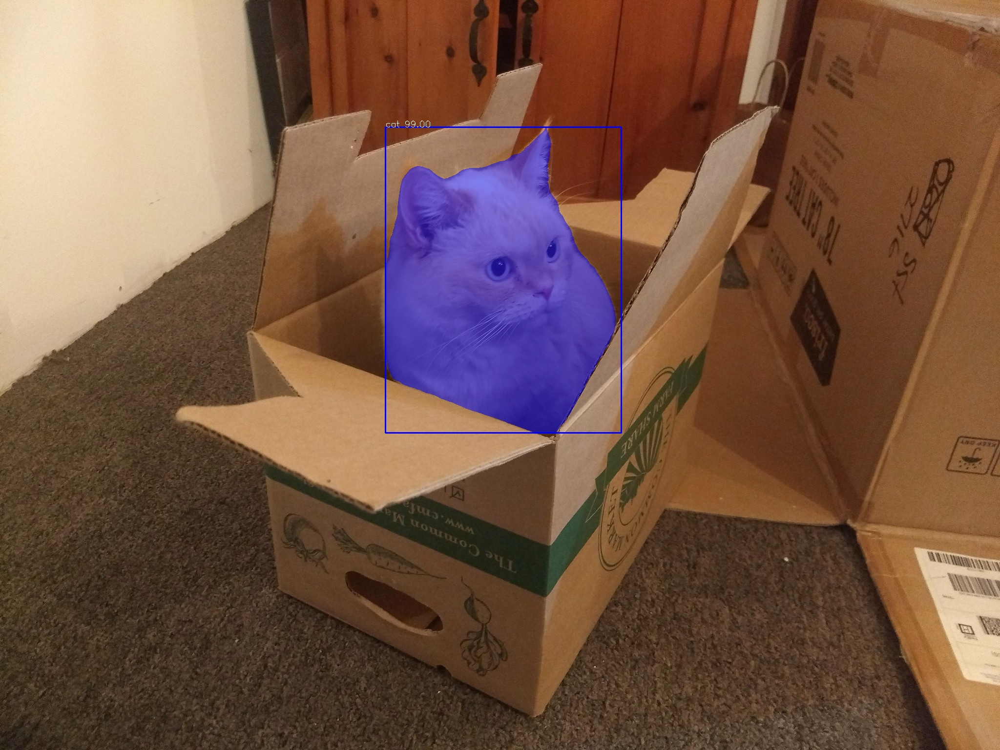

# Video Object Detection

## Quickstart

1. Make sure Python >= 3.7 and Git are pre-installed.

2. Clone this repository.

```
$ git clone git@github.com:liberaliscomputing/video-object-detection.git
$ cd video-object-detection
```

3. Create and activate a virtual environment. Install dependencies.

```
$ python3 -m venv venv && source venv/bin/activate
(venv) $ pip install --upgrade pip && pip install -r requirements.txt
```

4. Download the [PointRend](https://github.com/ayoolaolafenwa/PixelLib/releases/download/0.2.0/pointrend_resnet50.pkl) model.

```
(venv) $ wget --quiet https://github.com/ayoolaolafenwa/PixelLib/releases/download/0.2.0/pointrend_resnet50.pkl
```

5. This script requires two arguments.

```
(venv) $ python detect.py -h
```

- `SOURCE`: A path to source video
- `OUTPUT`: A path to output video

The following optional arguments can be passed in as well:

- `--model`: A model with pre-trained weights, defaults to `"pointrend_resnet50.pkl"`
- `--frames_per_second`: A Parameter that sets the number of frames per second for the output video, defaults to `3`

6. Run the following command with arguments.

```
(venv) $ python detect.py source.mov output.mov [--frame_per_second 10]
```

Source


Output

